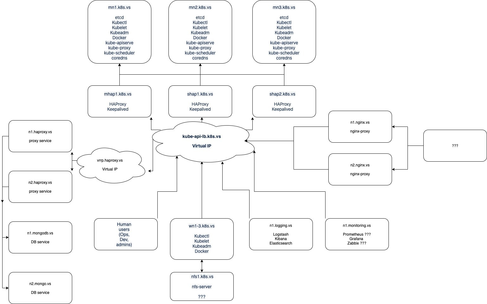

# otus-devops-final-project

OTUS DevOps Course final project

### Тема проекта

Создание процесса непрерывной поставки для приложения "Piggymetrics" с применением Практик CI/CD и быстрой обратной связью

### Цели проекта

Закрепить навыки полученные на курсе Отус "DevOps практики и инструменты"

 - Автоматизация процессов управления платформой (GCP)
 - Создание инфраструктуры для CI/CD
 - Создание инфраструктуры для сбора обратной связи
 - Практики IaC
 - Настройка CI/CD

### Описание приложения и его архитектура

Приложение для планирования финансов. Декомпозировано в виде 3 микросервисов: Account service, Statistics service, Notification service.
Так же в приложении присутствуют инфраструктурные сервисы: Config service, Auth service, API Gateway, Service discovery, etc..  
Приложение разработано на стеке Netflix OSS и имеет свои service discovery и config микро сервисы, это необходимо учесть при миграции в k8s. 

Попробовать приложение можно по [ссылке](http://35.240.15.150)

### Описание инфраструктуры

 - [Мониторинг](http://zabbix.semernya.ru)
 - [Тестовое прилоджение в кубере](test.semernya.ru)
 - [Логирование](kibana.semernya.ru)
 - [HAProxy на кубер](http://hapk8s.semernya.ru/ )
 - [HAProxy на БД](hap.semernya.ru)
 - [Alertmanager](alertmanager.semernya.ru)

### Этапы развития проекта и сроки

1 этап. MVP

 - создание проекта в системе управления проектами GitHub Projects [x]
 - настройка ChatOps [x]
 - получение и настройка DNS имени [x]
 - создание ВМ при помощи IaC (terraform) [x]
 - развертывание Kubernetes (ansible) [x]
 - развертывание системы логирования (ansible) [x]
 - развертывание системы мониторинга (ansible) [x]
 - развертывание системы алертинга (ansible) [x]
 - проверка безопасности приложения с помощью Snyk (DevSecOps) [x]
 - сборка приложения в GitHub Actions [x]
 
 > предзащита проекта 21 апреля 2020

2 этап. Реализация оставшихся 50%

 - контроль качества кода Sonar
 - трассировка запросов
 - dashboards
 - логирование  
 - доставка приложения после сборки
 - переезд на GitLabCI
 - иные настройки и улучшения
 
 > защита проекта 12 мая 2020

### Учасники и их роли

 - Денис Барсуков (PO, Dev, ChatOps, Pipeline)
 - Иван Кучин (Logging, Tracing)
 - Роман Ермолаев (Monitoring)
 - София Цигуро (Terraform)
 - Илья Семерня (Ansible, DNS, K8S)
 
